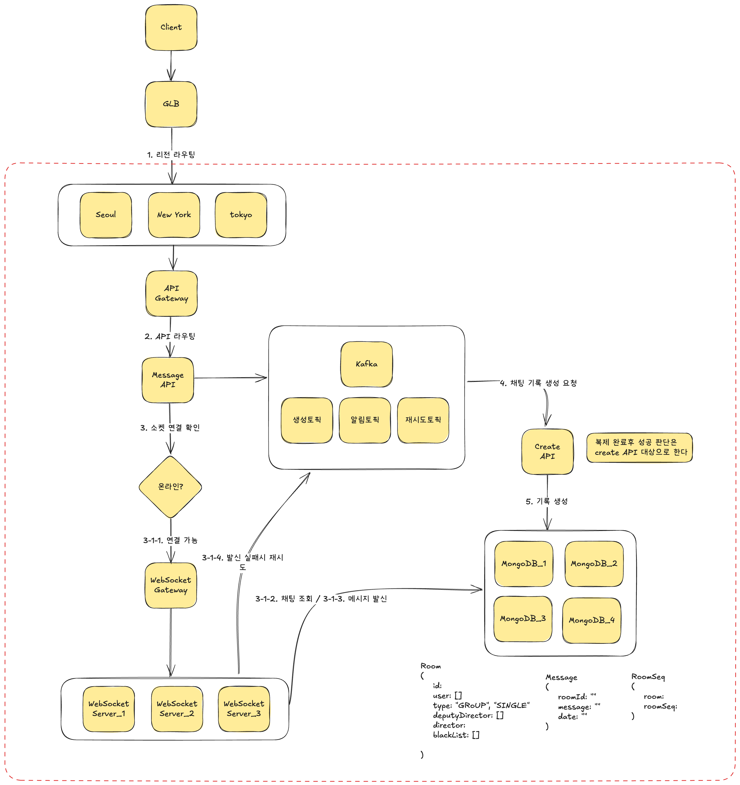

## 문제
### 1. 배경
   - 당신은 대규모 실시간 채팅 애플리케이션 LIME 설계자입니다.
   - LIME은 데스크톱 앱(Windows/macOS), 모바일 앱(iOS/Android) 을 모두 지원하며, 1:1, 그룹, 공개 채널(오픈채팅) 기능을 제공합니다.
   - 회사는 글로벌 출시를 앞두고 있으며, 성능·안정성·확장성 사이의 어려운 trade-off가 예상되는 요구 사항을 당신에게 전달했습니다.

### 2. 요구 사항
- **실시간성**
  - 각 사용자는 자신이 속한 리전 내에서 100ms 이내에 메시지를 수신해야 한다.
  - 리전 간 대화의 경우 200ms 이내에 메시지가 전달되어야 하며, 네트워크 지연이 있더라도 사용자는 즉시 반응을 체감해야 한다.
- **내결함성/내구성**
  - 메시지는 모든 복제본(AZ 간 포함)의 디스크 커밋이 완료된 후에만 전달 확정(ACK)으로 간주한다.
  - 단일 노드 또는 단일 AZ 장애로 인해 메시지 유실이 발생해서는 안 된다.
- **순서/일관성**
  - 동일한 방 내의 모든 참여자는 동일한 순서로 메시지가 보여야 한다.
- **트래픽 규모**
  - DAU 기준 5천만 명을 예상한다.
- **확장성**
  - 트래픽이 증가해도 아키텍처 구조 변경 없이 확장 가능해야 한다.
- **재접속 복구**
  - 사용자가 앱/브라우저를 재시작하거나 네트워크가 전환하더라도, 마지막 읽은 메시지 이후의 내역이 1초 이내로 복원되어야 한다.
  - 회사 경영진은 위의 모든 요구 사항을 서비스 성공을 위한 핵심 목표로 설정하고 있습니다.
  - 당신은 이 요구 사항을 바탕으로, 서비스의 본질적 가치를 훼손하지 않으면서 현실적으로 구현 가능한 아키텍처(통신 계층–메시징 계층–저장 계층)를 설계해야 합니다.

---

## 풀이

